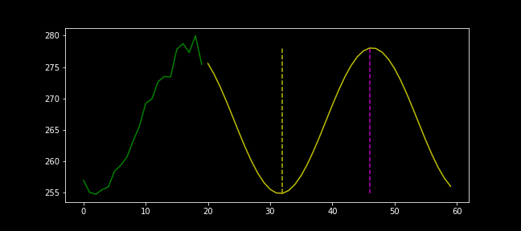
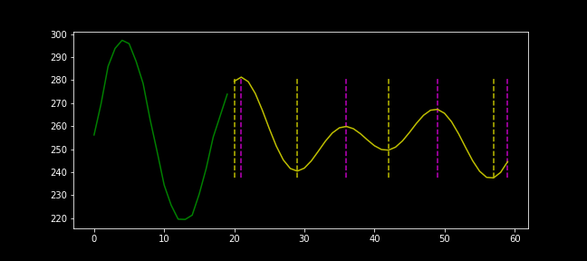

# Technical Analysis

Build trading strategy to maximize profit based on the past behaviour of a stock price

### Sample 1


### Sample 2


Input:
```json
[{'test_size': 40,
  'train': [256.98636727969256, 255.05460646709656, 254.78153806262748, 255.49777344911706, 255.948113422068,
            258.45731634320674, 259.3909461779992, 260.73281842090984, 263.30107253592536, 265.6002735253984,
            269.2245040736475, 269.93218022438015, 272.691631190999, 273.49871608942817, 273.41787105020296,
            277.81320435000566, 278.7297003873352, 277.3138392663913, 279.9929405142236, 275.4274844593286]},
 {'test_size': 40,
  'train': [262.1868074581374, 258.7329264840357, 255.85113525779656, 255.88672109181547, 259.628669106372,
            265.17800866739094, 273.4234443146018, 279.2331285547166, 286.64302727163073, 290.82080804150587,
            292.2340758236789, 295.97030452884223, 294.15552221889953, 288.35625999534983, 285.68810018551585,
            275.65714121113626, 271.1318001372785, 265.9748669850802, 264.4877211989593, 263.2641973678572]}]
```

Output:
```json
[[12, 26], [0, 7, 14, 20, 27, 35]]
```